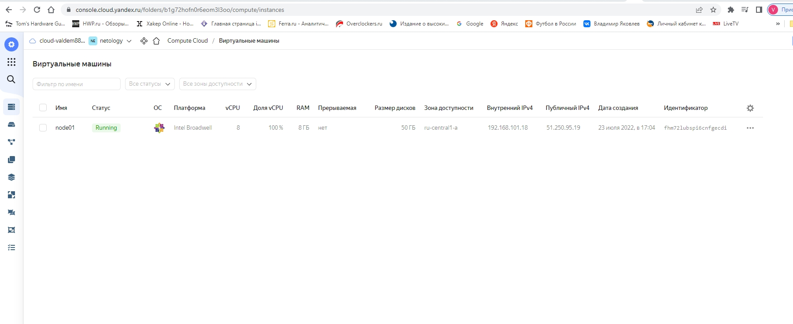
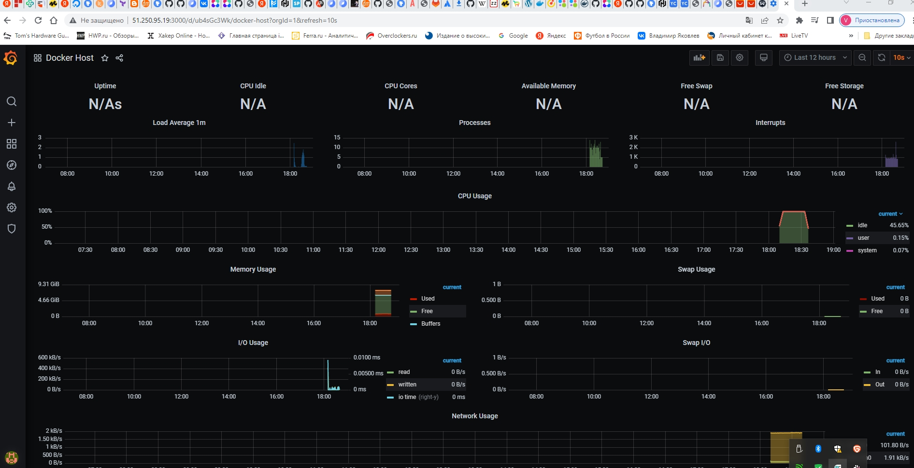
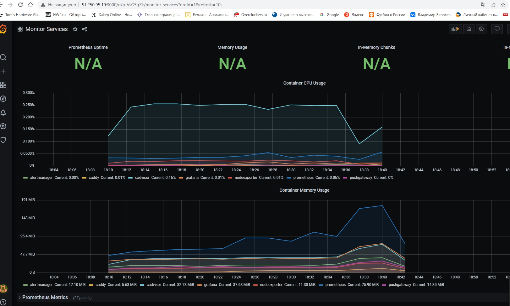

# 5.4. Оркестрация группой Docker контейнеров на примере Docker Compose - dev-17_virt4-yakovlev_vs
docker-compose &amp; yandexcloud

## Задача 1

Создать собственный образ операционной системы с помощью Packer.

Для получения зачета, вам необходимо предоставить:
- Скриншот страницы, как на слайде из презентации (слайд 37).

Решение


.jpg)


.jpg)

## Задача 2

Создать вашу первую виртуальную машину в Яндекс.Облаке.

Для получения зачета, вам необходимо предоставить:
- Скриншот страницы свойств созданной ВМ, как на примере ниже:

Решение



## Задача 3

Создать ваш первый готовый к боевой эксплуатации компонент мониторинга, состоящий из стека микросервисов.

Для получения зачета, вам необходимо предоставить:
- Скриншот работающего веб-интерфейса Grafana с текущими метриками, как на примере ниже

Решение






```bash
[centos@node01 stack]$ sudo docker-compose ps
    Name                  Command                  State                                                   Ports
-------------------------------------------------------------------------------------------------------------------------------------------------------------
alertmanager   /bin/alertmanager --config ...   Up             9093/tcp
caddy          /sbin/tini -- caddy -agree ...   Up             0.0.0.0:3000->3000/tcp, 0.0.0.0:9090->9090/tcp, 0.0.0.0:9091->9091/tcp, 0.0.0.0:9093->9093/tcp
cadvisor       /usr/bin/cadvisor -logtostderr   Up (healthy)   8080/tcp
grafana        /run.sh                          Up             3000/tcp
nodeexporter   /bin/node_exporter --path. ...   Up             9100/tcp
prometheus     /bin/prometheus --config.f ...   Up             9090/tcp
pushgateway    /bin/pushgateway                 Up             9091/tcp
```

```bash
[centos@node01 stack]$ ls -l
total 4
drwxr-xr-x. 2 root root   24 Jul 23 16:08 alertmanager
drwxr-xr-x. 2 root root   23 Jul 23 16:08 caddy
-rw-r--r--. 1 root root 3004 Jul 23 16:08 docker-compose.yaml
drwxr-xr-x. 2 root root   43 Jul 23 16:08 exporters
drwxr-xr-x. 3 root root   26 Jul 23 16:08 grafana
drwxr-xr-x. 2 root root   47 Jul 23 16:08 prometheus
```
Playbook отработал все микросервисы запустились. Но непонятно почему не все метрики собирает.

Исходники брал сначала по ссылке на домашку (virt-11). Потом взял из virt-09, то что говорил преподаватель в лекции. Пересоздал ВМ и прогнал playbook. Метрики так же не все собирает. 

